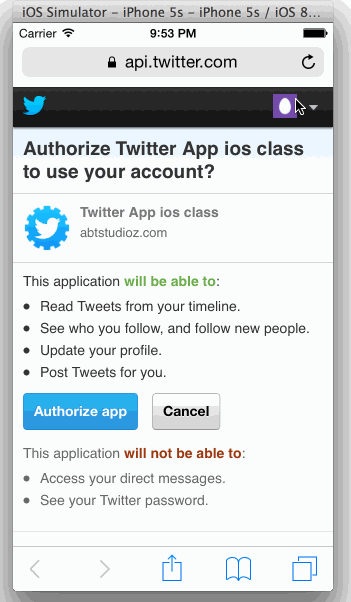

Twitter Like App
================

Swift App which uses Twitter API to show & post tweets

Completed user stories:

   * [x] Required: User can sign in using OAuth login flow
   * [x] Required: User can view last 20 tweets from their home timeline
   * [x] Required: The current signed in user will be persisted across restarts
   * [x] Required: In the home timeline, user can view tweet with the user profile picture, username, tweet text, and 
                   timestamp. In other words, design the custom cell with the proper Auto Layout settings. You will 
                   also need to augment the model classes.
   * [x] Required: User can pull to refresh
   * [x] Required: User can compose a new tweet by tapping on a compose button.
   * [x] Required: User can tap on a tweet to view it, with controls to retweet, favorite, and reply.
  

Walkthrough of all user stories:

GIF created with [LiceCap](http://www.cockos.com/licecap/).

Initial commits from:
tejal-par user (same as this user)
